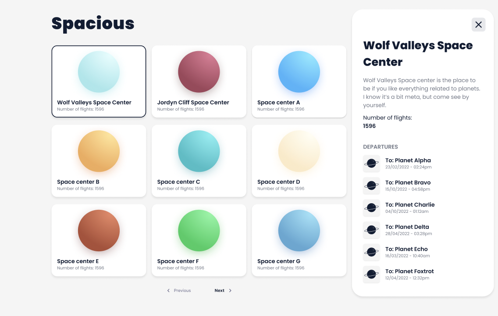

# Frontend assessment



Welcome to the Strapi frontend assessment 🙂

This assessment is about checking whether you and Strapi are a good fit, technically. We expect you to show what you know and what you like to do (and it's okay not knowing everything).

The goal of the assessment is to create an app (front-end) that manages space trip entities by following the requirements specified below.

You have 7 days to do the assessment and send it back to us.

Please, **do not** put your code on a public repository on GitHub.

Feel free to ask questions. Don't stay stuck for too long if you have difficulties or miss information.

You may want to keep track of specific choices you make so you can explain them to us later.

We hope you'll have fun doing it 🙂 good luck!

## Context

You just saw the Star Wars movies and you really liked them (even though there are some scenario choices you're not sure you approve). You've decided to join a Star Wars fan group to talk about your new interest and you've met them for the first time yesterday evening, it went really well. They are interested (that) you are a developer and would like you to develop something for the group.

Here is what they tell you:

"We currently have the project of creating a new world where adventures can happen. We imagine the planets of this world but it's difficult to keep track of what we have already done on paper (in order) to travel between planets. It would be nice to have an app to easily see how to go from (planet) Earth to another planet. The idea is to be able to create and view the space centers of the Earth planet and their available flights. What do you think? We all are developers too but we don't currently have the time to develop it. Would you be interested in developing it?"

Enthusiastic to help your new group of friends, you accept.

One week later, you send them the app you wrote so they can run it locally and give you feedback on app functionalities and the code quality.

## Requirements

### General

- Use `git` to version your code
- Make sure to include all instructions for reviewers to install, run the tests and start the front-end and the back-end.
- Use the required libraries specified below, you can use more if needed
- Follow the provided [Functional specifications](#functional-specifications)
- Feel free to use the [./resources/additional-assets](./resources/additional-assets) or not ; there are here only to help you

You'll develop an app that consumes the GraphQL service you are provided with a space centers list and their flights.

- Use `React` and `create-react-app`
- Use `apollo-graphql` for querying the GraphQL service
- Use `styled-components`
- If you're not comfortable with a certain part of the exercise, feel free to choose alternatives and to mention them.
- A README.md file describing project setup (commands to run, environment variables, etc.) and tradeoffs you have made
- The designs to follow are available on [Figma](https://www.figma.com/file/mlczslBrFwNXcZ6jY1G15R/Strapi---Front-end-test?node-id=0%3A1)
- Use the provided assets at: [./resources/assets](./resources/assets)

**Bonus**: if you have extra time and want to have fun you can do the following:

- Write some relevant tests
- Add pagination to the flights list of a space center

## Functional specifications

With this application, the user should be able to list **the space centers and their departures flights**.

In the following specifications, there are many things to implement. However, everything related to "friendships" is optional and will be considered a "bonus". It's not the part we hope you'll invest too much effort and time in.

### Acceptance tests

#### As a regular user,

Given that **I am on the `space centers`page and being on the `/` URL**

- I'm provided with a **list of all the space centers**.
- When **I select a specific space center** on the space centers grid, I'm provided with **a sidebar showing all the flights leaving from this space center**.
  - I am provided with **the space center's description**
  - I am provided with the **number of flights leaving the space center**
  - I can see a list of the **departures of the space center** displaying both the **departureAt** information and the name of the **landing site**

## Environment

### Back-end

You're provided with a [`docker-compose.yml`](./docker-compose.yml) file that spawns a backend for you: **you don't have to create one**.

In order to start the containers, run the following in a terminal:

```sh
$ docker-compose up -d
```

After spawning them up, you will be available to access a Graphql API (+ playground) on `http://localhost:3000/graphql`.

We strongly advice to play with the different queries available on the Graphql Playground in order to use the good ones.

**Note:**

When setting up your Graphql configuration (on the frontend), make sure to pass the following header in order to be able to have access to the queries:

```json
{
  "Authorization": "Bearer API_KEY"
}
```
